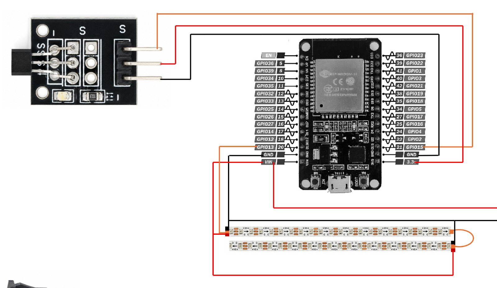
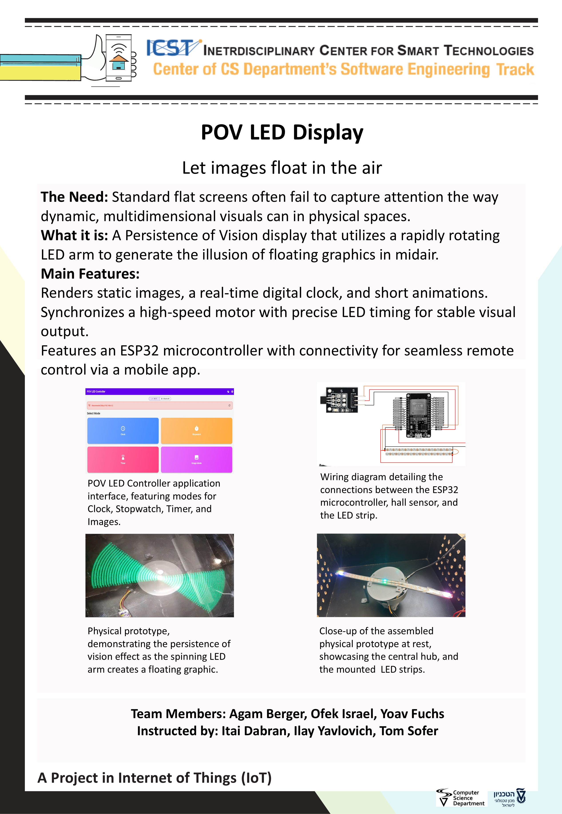

## Holographic POV Display Project by:  
* Yoav Fuchs
* Ofek Israel
* Agam Berger
* Instructors: Itai Dabran, Ilay Yavlovich, Tom Sofer
  
## Details about the project
A Persistence of Vision (POV) holographic display system consisting of a spinning physical LED arm (ESP32-based) controlled dynamically via a Flutter mobile app. Features include live weather fetching, real-time fan RPM monitoring via Hall Effect sensor, customizable clock/text displays, and the ability to natively compile and beam full-circle gallery images via Bluetooth Low Energy (BLE).
 
## Folder description :
* `ESP32`: source code for the esp side (firmware).
* `flutter_app` : dart code for our Flutter app.
* `Documentation`: wiring diagram + basic operating instructions, installation, and user manual.
* `Unit Tests`: tests for individual hardware components (NeoPixels, Hall Sensor).
* `assets`: link to 3D printed parts, Audio files used in this project, connection diagrams, and project poster.

## 3D CAD Model:
* [Onshape 3D Model](https://cad.onshape.com/documents/2e47ebf40bac88e7c8e60137/w/568b95f7798c476dea5965f9/e/33907529190e6024b653af3e)

## SDK Versions used in this project: 
* **ESP32 Core Framework**: v2.0.18
* **Flutter SDK**: v3.44.1 (Dart v3.12.1)

## Arduino/ESP32 libraries used in this project:
* Adafruit NeoPixel - version 1.15.1
* BLEDevice / BLEUtils / BLEServer (Built-in ESP32 BLE Library)

## Hardware List:
* 1x ESP32 Microcontroller
* 1x WS2812B NeoPixel LED Strip
* 1x KY-003 Hall Effect Sensor 
* 1x Neodymium Magnet
* 1x DC Motor

## Connection diagram:

## Project Poster:

 
This project is part of ICST - The Interdisciplinary Center for Smart Technologies, Taub Faculty of Computer Science, Technion
https://icst.cs.technion.ac.il/
